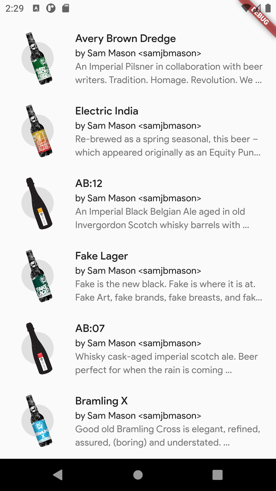
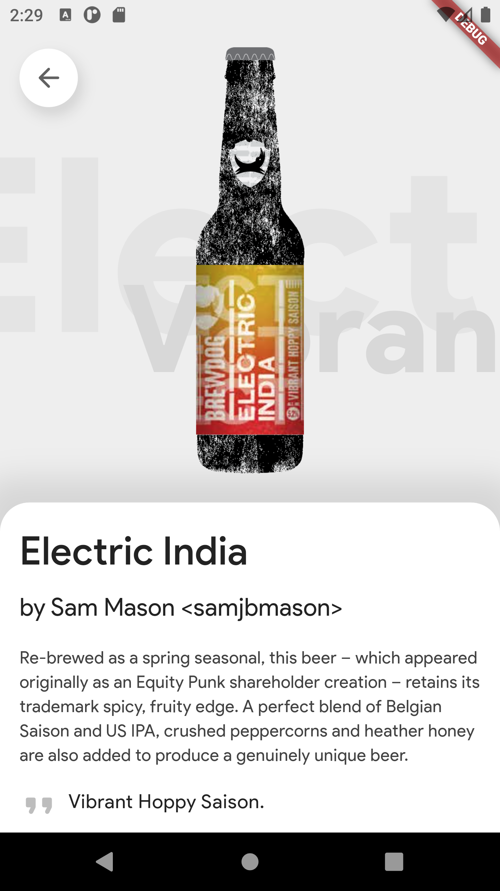

# Beer recipes Flutter app

This is beer repices Flutter app which utilizes PUNK API V2 (https://punkapi.com/documentation/v2).

Built apk is available [here](https://www.hesoyam.ee/shared/apks/beers.apk).

# Screenshots

|   |   |
| - | - |
|   |  |
|   |   |

# Code notes

- Tried separating the UI code to little widgets and put them all in their own files. This is a test of "Java-like" approach.
- Beer description texts (BeerDetailsTextBlock) implementation is questionable, because it seems that it should be done in a different way, rather than a buch of stacked text widgets. However, in my opinion it is still understandable and maintainable.
- BloC classes and tests were written with the help of BloC official tutorials, so some code might have been yoinked from there. 👀
- Skipped creating a repository for API calls, because it seemed like a huge overkill. So PUNK API calls are done in `lib/blocs/beers_bloc.dart`.
- Test coverage is lacking to say the least and tests are rather there for showcase.
- The code has little to no comments, because the app is supposed to be simple (I hope) and should be following clean code principles (I hope). Though, some widgets do have explanations where it seemed necessary.

# Technical details

The project was built with Flutter version 3.3.0 and Dart version 2.18.0.

# Testing

Execute `flutter test` to run all test cases.

